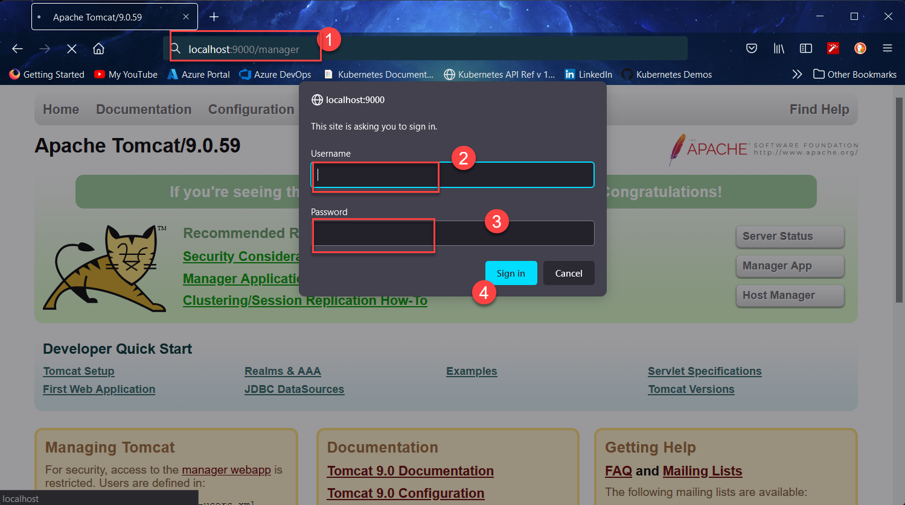

# Jenkins CI/CD Lab

Deploy Jenkins and Tomcat containers in group. Tomcat would be used as "deployment target" for the jenkins job.

> This lab environment can be deployed on `docker desktop` or `docker playground`.

## The Steps :

1.	Download [compose file](./docker-compose.yml) into an empty directory and then deploy 
	```
	# Validate the compose file
	docker compose config 
	# deploy all services
	docker compose up -d
	# List the services running
	docker compose ps
	```

	

1. Login into jenkins dashboard on port `10000` using following credentials
	
	```
	Username: mahendra
	Password: password@1234
	```

	


1.	Login into tomcat manager on port `9000` with following credentials

	```
	Username: manager
	Password: manager
	```
	
	


1.	Now, in jenkins dashboard, create a new `Free style project` with Following details:

	```yml
	Project-Name: Job1
	Project-Type: Freestyle 
	Source-Control:
		git: https://github.com/mahendra-shinde/ci-servlet-demo
	Build-Triggers:
		Poll-SCM: 
			Schedule: " H/2 * * * * "
	Build:
		Invoke top-level Maven Target:
			Maven-Version: M3
			Goals: package
	```

1.	Click save button and then use `Build Now`

1.	Now, Open Jenkins Plugin Manager
	
	

1.	Click on "Available" Tab and then search and install "deploy to container" plugin.

	

1.	You need to add credentials for tomcat manager using the `Add` button and then `Jenkins`

	

1.	You need to add tomcat manager credentials

	```yaml
	Username: manager
	Password: manager
	ID: tom
	Description: Tomcat-Manager
	```

	

1.	Now, set the Tomcat Manager URL to `http://tomcat:8080/manager/text` and save the job.
	
	> The Tomcat Manager URL set to http://tomcat:8080/manager/text which is a private address only accessible to `jenkins` container as it is in same private network as `tomcat` container.
	W

	


1.	Build the job manually and wait for success message.

1.	Verify The application deployment via Tomcat Manager `http://localhost:9000/manager`

	

1.	Click on the link `/app` to visit the website.

	